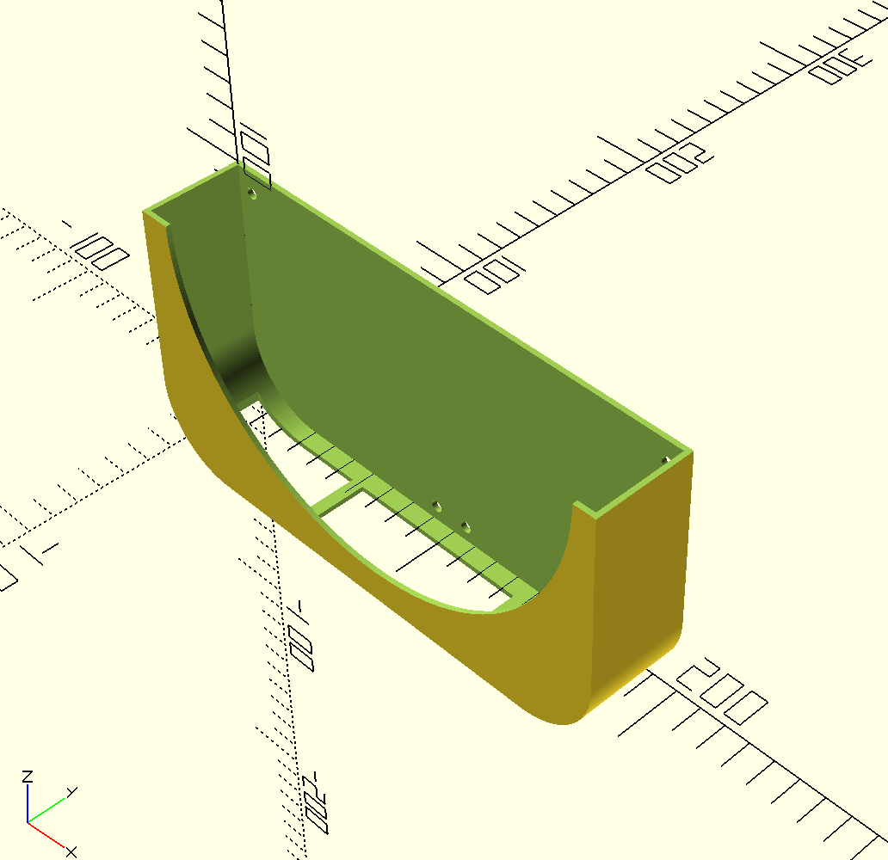
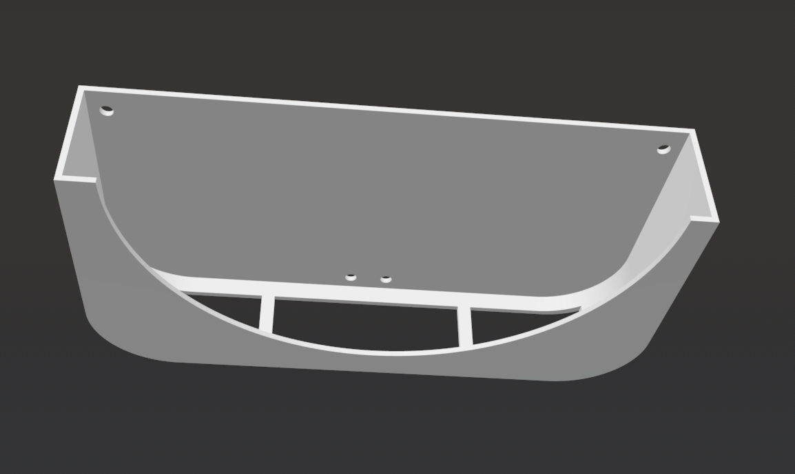
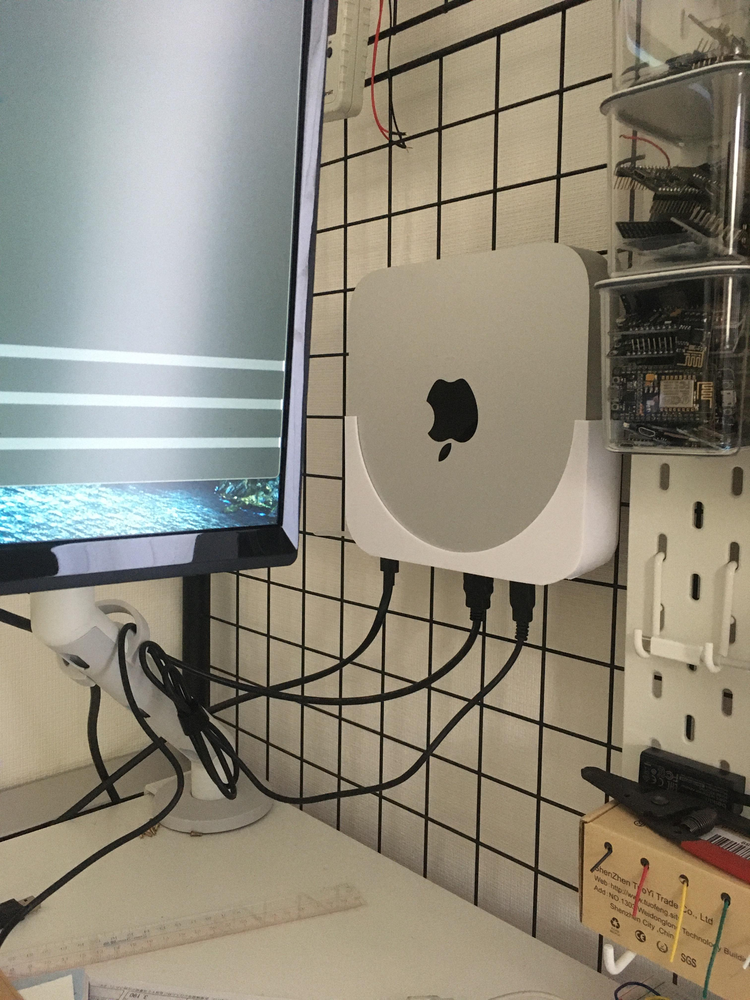

# mac-mini-mount

A simple OpenSCAD design for mounting an M1 Mac Mini on a wire wall rack.

The `.x3g` file was created for the Flashforge Creator Pro.

OpenSCAD can generate a `.stl` file from `.scad` source, which can then be imported into your 3D printer software of choice.

